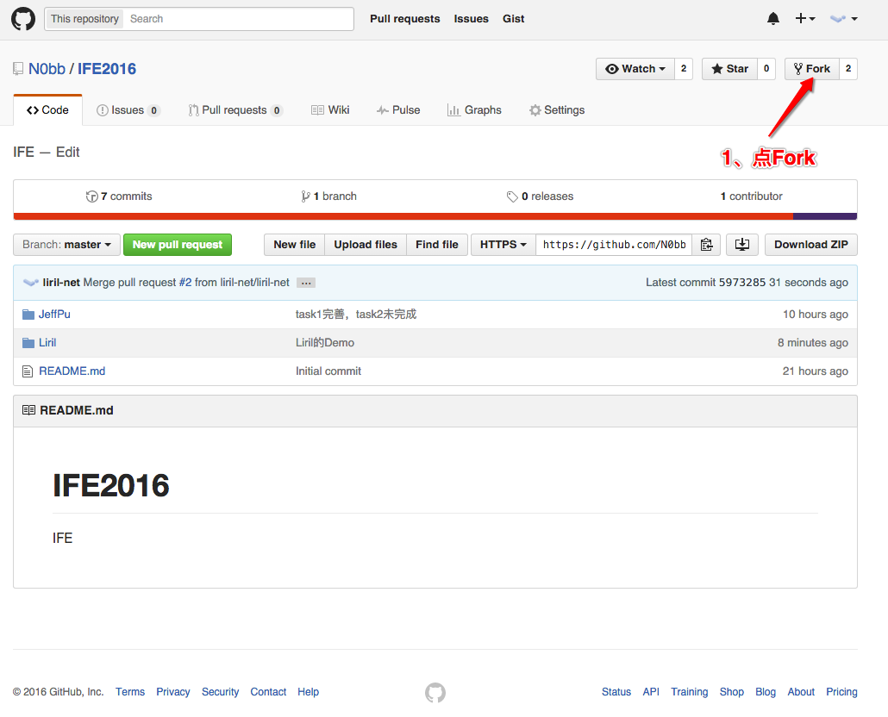
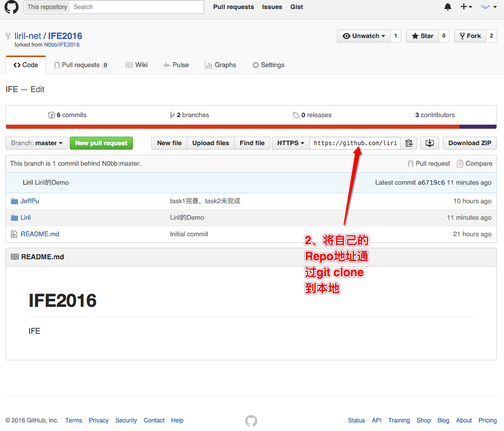
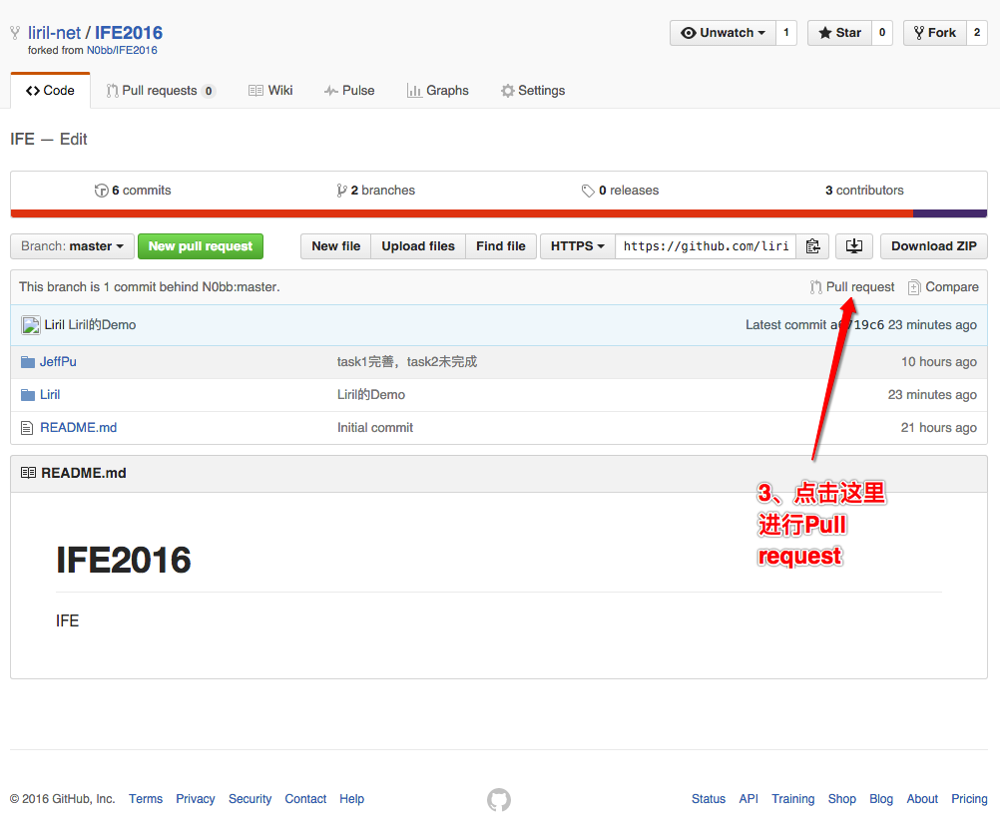

# Git初探

## Git Fork
去Github打开这个项目，然后点击Fork

## Git Clone
到自己的项目下，通过git clone将项目克隆到本地

## Git Branch
通过`git branch yourname`指令为自己的项目新建一个分支，其中yourname改成自己的名字

## Git Checkout
通过`git checkout yourname`指令将分支切换到自己的分支

## 正常操作
新建自己名字的文件夹，并进行文件操作，如写项目等

## Git Add
通过`git add -A`指令将所有的项目添加到git本地库，进行追踪

## Git Commit
通过`git commit -m "这里写这次提交的信息，一般写做了什么事情"`提交改变

## Pull Request
将本地项目Pull request请求与主项目合并，根据相应提示填写。
